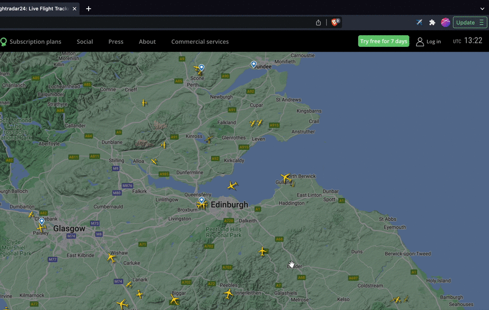

# Flightradar24 chat

Everyday thousands of aviation enthusiasts follow flights in [flightradar24](https://flightradar24.com). A feature I miss on the website though, is a chat where you can talk with other people following an specific flight.

This project attempts to fill this gap with a chrome extension.

  

## How it works

This monorepo contains two main folders:
- Client: All the code needed to build the chrome extension. I used [this boilerplate](https://github.com/Jonghakseo/chrome-extension-boilerplate-react-vite) to bootstrap it. Built with React, Vite, Tailwind & TRPC.
- Server: Backend that exposes TRPC endpoints. Uses Fastify, PostgreSQL, Prisma & TRPC.

## More details

A session is created when the user opens the popup for the first time whose id is saved as a signed cookie. The name of the session is a random concatenation of an adjective with an aircraft's name. 

The `flightId` is extracted from the browser's url and is used as a `chatId` for the next received and sent messages.

Messages are fetch with a TRPC endpoint used as an infinite query for retrieving older messages. New messages are received through a TRPC subscription.

The server uses a `ChatPubSubPort` to make the subscriptions work. At the moment this port uses a memory adapter at runtime but it's ready to use a Redis adapter, for example, to make horizontal scaling posible.

## How to run it locally

1. Clone the repo
2. Run `yarn` to install client and server dependencies.
3. `cd client && cp .env.template .env`
4. Run `yarn dev` in the client folder.
5. Open a new terminal and `cd server && cp .env.template .env`
6. Run a PostgreSQL instance, get the url and paste it in `.env`
7. Run `yarn dev` in the server folder.
8. Go to "manage extensions" in chrome and use the "load unpacked" button to open the `client/dist` folder
9. Done! You can open the popup now.

